# 愉阅 JoyRead

_此仓库为前端部分，去往[后端部分](https://github.com/PeerlessMonster/JoyRead_backend)_

## 先看东西 🤩

### 核心功能

- **丰富的排版样式**  
  单个段落支持标题、注释、背景、引用、正文等样式  
  段落内单个文字支持加粗、倾斜、上色、加粗并上色、倾斜并加粗等样式  
  支持图片，包括动图

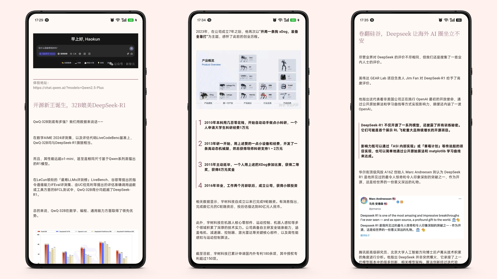
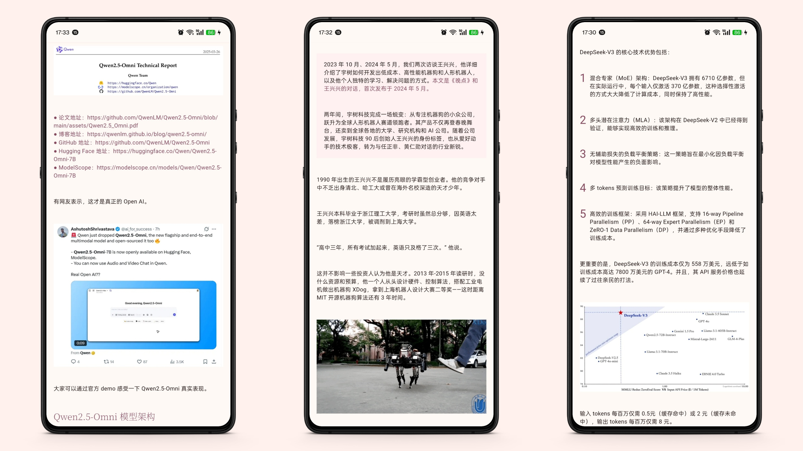

- **混合搜索**  
  融合全文检索及语义检索的结果

- **聊天机器人**  
  直接提问
  > *DeepSeek-R1 参数量是多少*  
  > _今天最热门的 5 条资讯_  
  > _最新 2 条资讯关注的共同领域是什么_  
  > _……_

  阅读资讯时提问
  > *Qwen 2.5-Omni 参数量是多少*  
  > _概括一下这篇文章的内容_  
  > _……_

### 基础体验

- **自适应设计**

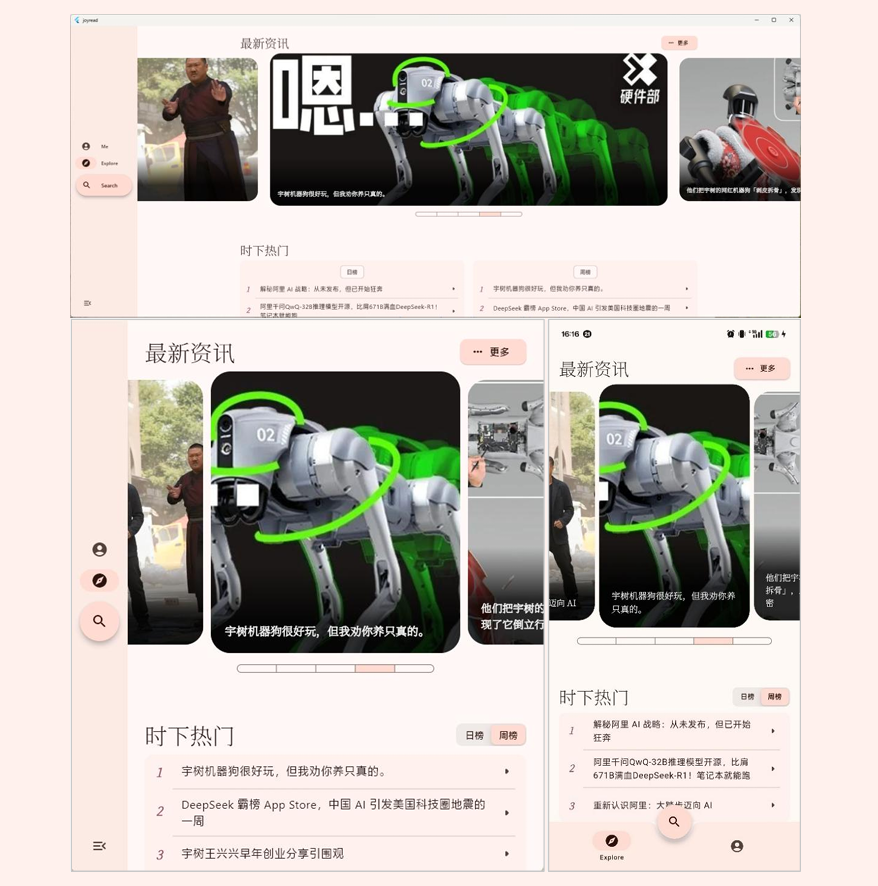

- **视觉无障碍的色彩主题**

- **暗色模式**

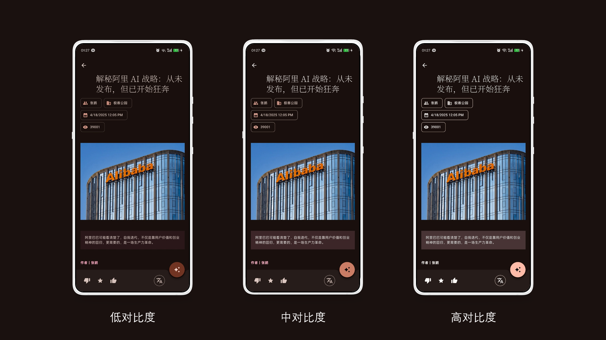

### 更多……全局加载状态提示

- **请求页面**

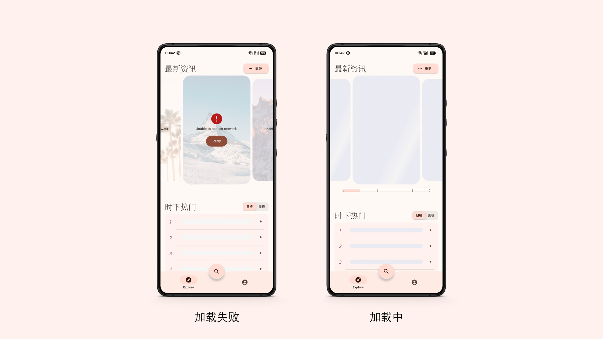

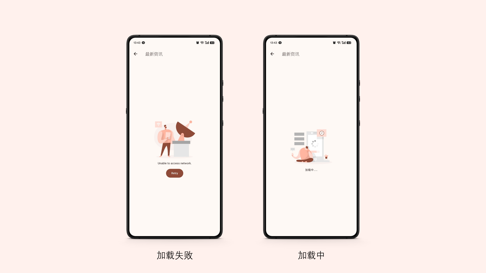

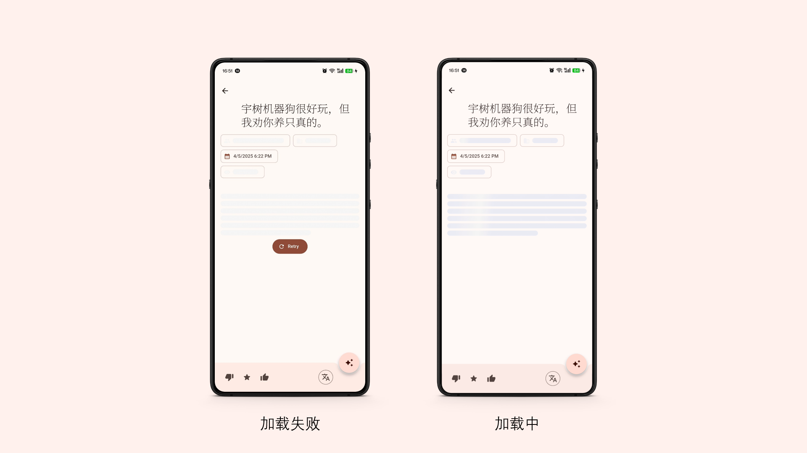

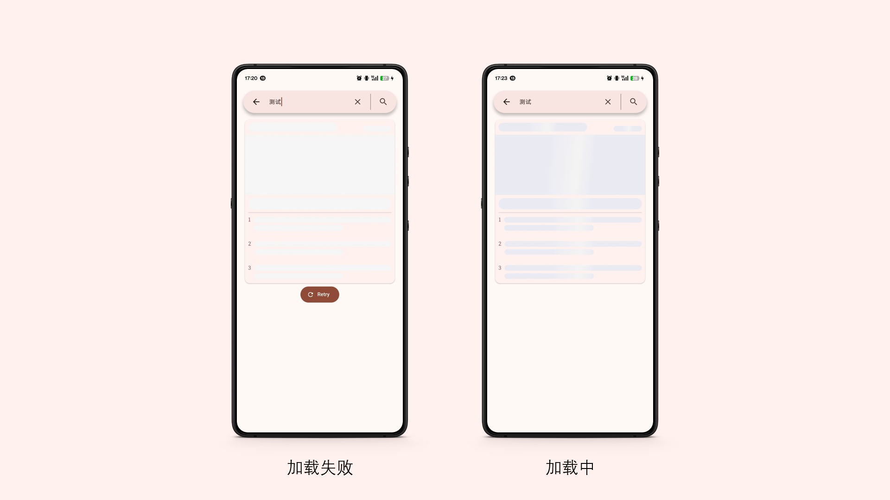

- **滑动列表请求**

- **请求聊天回答**

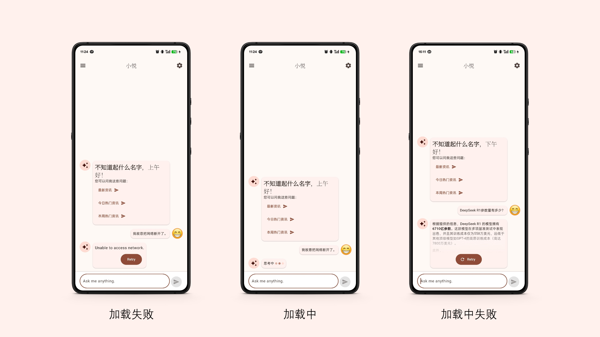

- **请求网络图片**

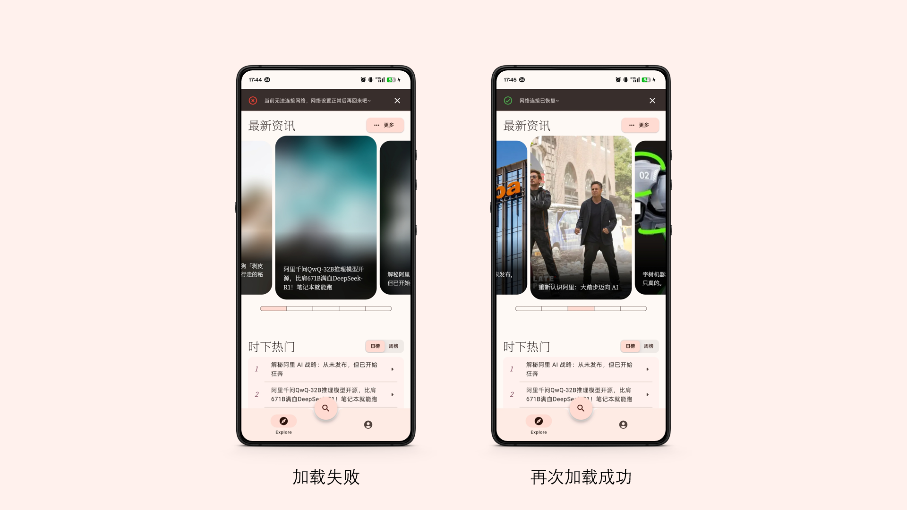
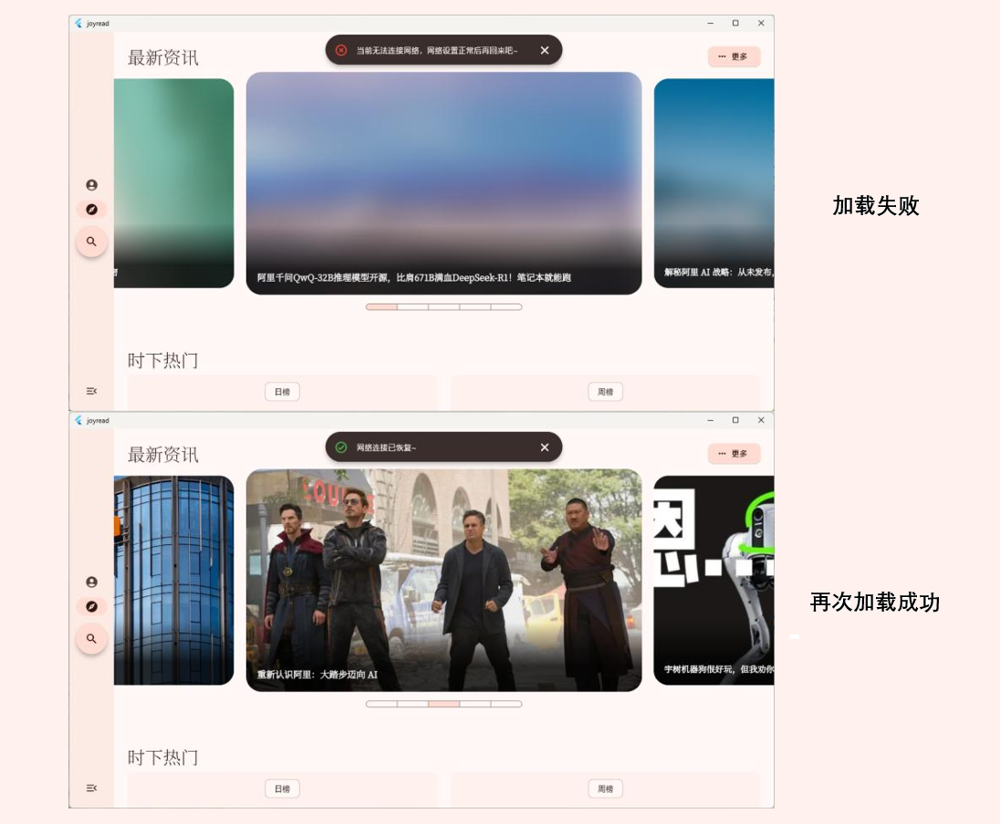

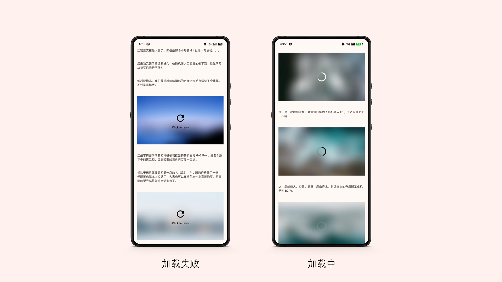

## 大感谢 🫡

### 依赖

- 框架：[Flutter](https://flutter.dev/)
  - [card_swiper](https://pub.dev/packages/card_swiper)
  - [EventFlux](https://pub.dev/packages/eventflux)
  - [extended_image](https://pub.dev/packages/extended_image)
  - [extended_list](https://pub.dev/packages/extended_list)
  - [get_storage](https://pub.dev/packages/get_storage)
  - [skeletonizer](https://pub.dev/packages/skeletonizer)

### 开发工具

- [FVM](https://fvm.app/)

### 素材

- 插画来自 [Pixels Market | High-Quality Design Assets for Every Project](https://pixels.market/)
- 壁纸来自 [Beautiful Free Images & Pictures | Unsplash](https://unsplash.com/)

**无商业用途！仅作学习客户端开发**
